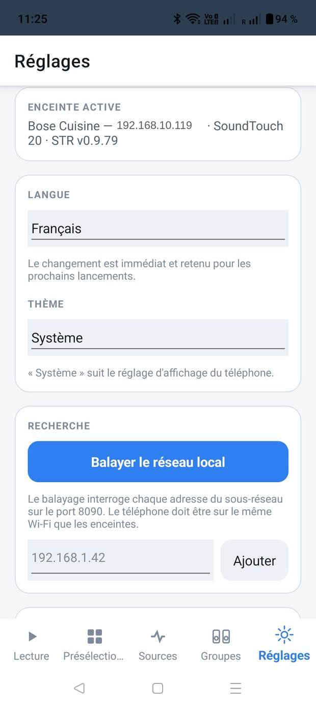
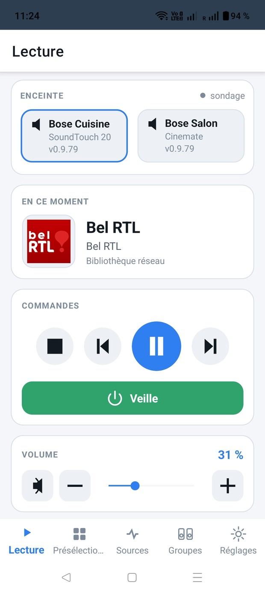
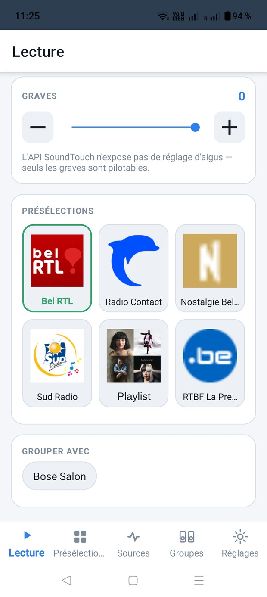
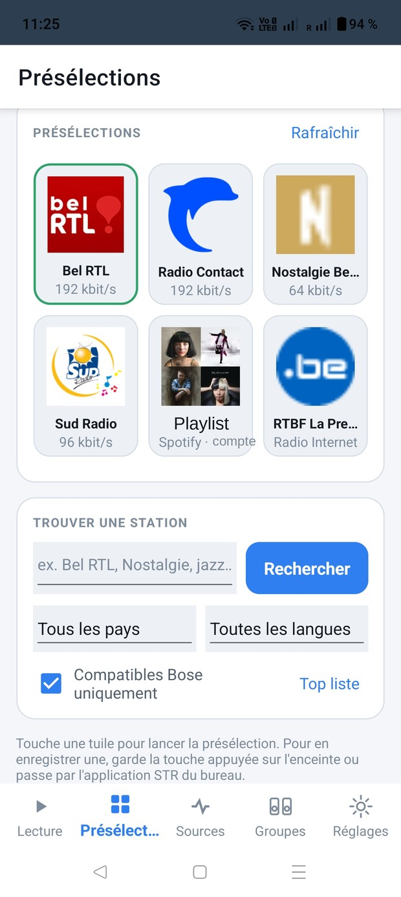
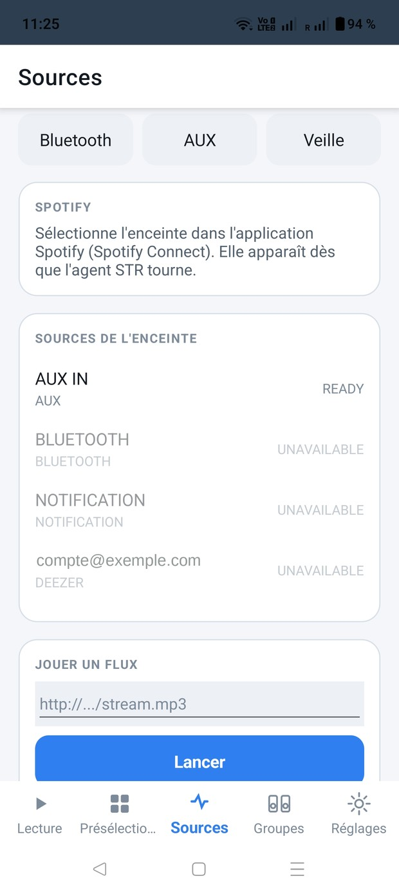
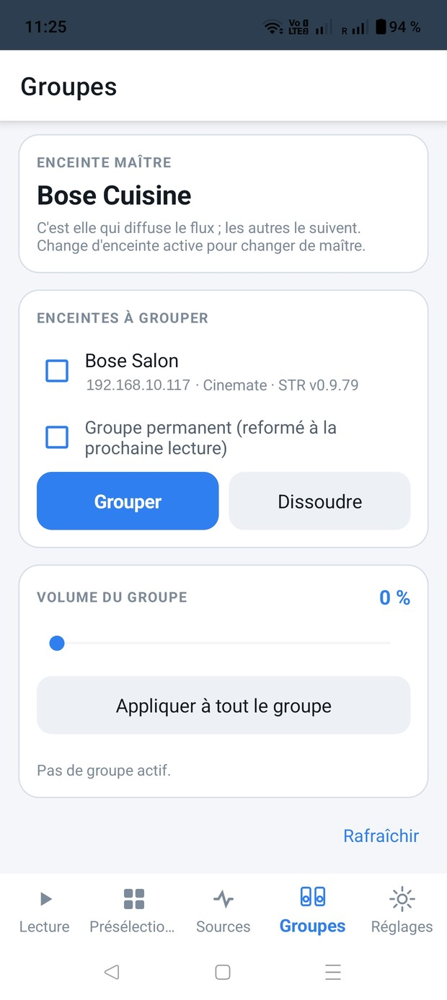
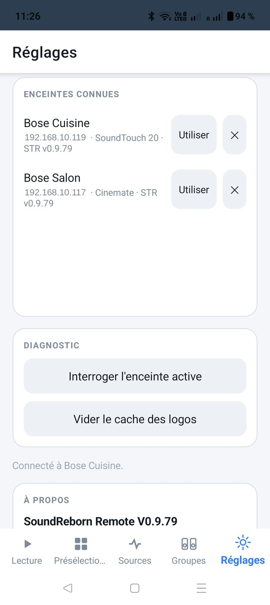

# SoundReborn Remote — Manual de uso

Versión 0.9.81 · Android 7 y posteriores

> Idiomas: [Français](fr.md) · [English](en.md) · [Deutsch](de.md) · [Nederlands](nl.md) · **Español**

---

## Índice

1. [Lo que hace falta antes de empezar](#1-lo-que-hace-falta-antes-de-empezar)
2. [Instalación](#2-instalación)
3. [Primer arranque](#3-primer-arranque)
4. [La pestaña Reproducción](#4-la-pestaña-reproducción)
5. [La pestaña Presintonías](#5-la-pestaña-presintonías)
6. [La pestaña Fuentes](#6-la-pestaña-fuentes)
7. [La pestaña Grupos](#7-la-pestaña-grupos)
8. [La pestaña Ajustes](#8-la-pestaña-ajustes)
9. [Gestos](#9-gestos)
10. [Qué hacer si…](#10-qué-hacer-si)
11. [Límites conocidos](#11-límites-conocidos)
12. [Avisos](#12-avisos)

---

## 1. Lo que hace falta antes de empezar

SoundReborn Remote controla altavoces **Bose SoundTouch** desde un teléfono o una tableta
Android. Todo ocurre en tu red local: sin cuenta, sin servicio en línea, sin datos que
salgan de casa.

Tres condiciones:

- **El teléfono y los altavoces en la misma wifi.** Cuidado con las redes de invitados y
  con los routers que aíslan los aparatos entre sí: en ese caso no se encontrará nada.
- **El agente STR instalado en los altavoces.** Es lo que sustituye a la nube de Bose
  desde que se apagó, el 6 de mayo de 2026. Sin él la aplicación sigue funcionando, pero
  limitada a lo que expone el firmware por sí solo: volumen, graves, teclas ya guardadas.
  La búsqueda de emisoras, la asignación de teclas y la agrupación fiable pasan todas por
  el agente.
  La instalación se hace con la herramienta STR para PC o Mac — <https://st-reborn.de>.
  **Esta aplicación no lo instala**; solo señala los altavoces que no lo tienen.
- **Android 7 o posterior.**

---

## 2. Instalación

La aplicación no se distribuye por Play Store. Se descarga en la página *Releases* del
proyecto: <https://github.com/ben240374/SoundRebornRemote/releases>

1. Descarga el archivo `.apk` en el teléfono.
2. Ábrelo. Android pedirá permiso para instalar desde un origen desconocido: concédeselo a
   la aplicación que ha descargado, normalmente el navegador.
3. Instala y abre.

En el primer arranque no se pide ningún permiso especial: la aplicación no accede ni a los
contactos, ni a la ubicación, ni al almacenamiento.

---

## 3. Primer arranque

La aplicación se abre en el idioma del teléfono si lo conoce — francés, inglés, alemán,
neerlandés, español — y en inglés en caso contrario. Podrás cambiarlo cuando quieras.

En el primer arranque no hay ningún altavoz conocido. Ve a **Ajustes** y luego a
**Escanear la red local**.

La búsqueda se hace en dos tiempos. Primero pide a los aparatos que se anuncien (mDNS):
es la vía rápida, dos o tres segundos. Si nadie responde, consulta una por una las 254
direcciones de la subred en el puerto 8090, lo que tarda unos segundos más pero funciona
incluso donde se filtra el multicast.

Los altavoces encontrados aparecen bajo **ALTAVOCES CONOCIDOS**. Toca **Usar** en el que
quieras controlar. Queda memorizado: en el siguiente arranque la aplicación se reconecta
sola.

Si el escaneo no encuentra nada pero conoces la dirección IP del altavoz, escríbela en el
campo previsto y toca **Añadir**.

---

## 4. La pestaña Reproducción

La pantalla principal, la que se abre para actuar deprisa.

### Elegir el altavoz

Arriba, una tarjeta por altavoz conocido, con su modelo y la versión de su agente STR. La
tarjeta con borde azul es el altavoz que se controla; toca otra tarjeta para cambiar, sin
pasar por los ajustes.

El puntito de la derecha indica el enlace: **directo** significa que el altavoz envía sus
cambios en tiempo real, **sondeo** que la aplicación los vuelve a leer a intervalos. En
modo sondeo, un cambio hecho desde otro mando tarda uno o dos segundos en aparecer.

### En este momento

La carátula, el título y la fuente de lo que suena. Para una emisora, su logotipo y su
nombre; para Spotify, la portada del álbum.

### Mandos

Cuatro teclas: parar, anterior, reproducir/pausar, siguiente. Según la fuente, algunas no
tienen efecto: una radio en directo no se rebobina.

La banda verde **Reposo** apaga el altavoz; una vez apagado, pasa a leerse **Encender**.

### Volumen

Silencio, menos, control deslizante, más. El porcentaje aparece a la derecha.

Cuando el altavoz forma parte de un grupo, este control pasa a ser **el volumen de todo el
grupo**: moverlo desplaza todos los altavoces la misma cantidad, lo que conserva el
equilibrio que hayas fijado entre ellos. Los volúmenes individuales siguen disponibles en
la pestaña Grupos.

### Graves y presintonías

Los graves van de -10 a +10 según el modelo. **No hay control de agudos**: la API del
altavoz no ofrece ninguno; no es un olvido de la aplicación.

Las seis presintonías se repiten aquí para ahorrar un cambio de pestaña. La tarjeta con
borde verde es la que suena.

### Agrupar con

Un botón por cada uno de los demás altavoces. Tócalo para sumarlo al grupo; aparece una
marca de verificación. Tócalo de nuevo para sacarlo. El altavoz controlado es el
**maestro**: es el que emite, los demás lo siguen.

El enlace **Actualizar**, abajo, vuelve a leerlo todo: título en curso, carátula, volumen,
estado del grupo.

---

## 5. La pestaña Presintonías

### Las seis teclas

Las mismas que las teclas físicas del altavoz. Cada tarjeta muestra el logotipo de la
emisora y su tasa de bits. Tócala para empezar la reproducción; el borde verde marca la
que suena.

Los logotipos se descargan y luego se conservan localmente. Si falta alguno, la emisora no
publica una imagen utilizable o su servidor no responde.

### Encontrar una emisora

El campo de búsqueda consulta **radio-browser.info**, un directorio abierto mantenido por
voluntarios. Dos listas desplegables acotan la búsqueda a un país y a un idioma, y **Top
lista** muestra las emisoras más escuchadas sin escribir nada.

La casilla **Solo compatibles con Bose** viene marcada y conviene dejarla así: descarta
los formatos que los altavoces SoundTouch no saben decodificar (Ogg, Opus, FLAC), que
producirían silencio sin mensaje de error.

Toca un resultado y se abre una hoja de acciones con

- **Escuchar** — lanza la emisora al instante, sin guardar nada;
- **① Asignar a esta tecla** si la tecla está libre, o **① Sustituir Bel RTL** si está
  ocupada: se muestra el nombre de la emisora que ya hay, para que no sobrescribas una a
  la que tenías aprecio.

**La asignación exige el agente STR.** Sin él solo es posible la escucha inmediata; el
guardado se hace entonces manteniendo pulsada la tecla en el propio altavoz, o desde la
aplicación STR de escritorio.

---

## 6. La pestaña Fuentes

**Bluetooth**, **AUX** y **Reposo** arriba: tres atajos directos.

**Spotify** no se controla desde esta aplicación. Abre Spotify en el teléfono y elige el
altavoz en el selector de dispositivos (Spotify Connect): aparece allí en cuanto el agente
STR está en marcha.

**Fuentes del altavoz** enumera lo que el altavoz declara, con su estado: `READY` significa
disponible, `UNAVAILABLE` que la fuente existe pero no es utilizable — normalmente un
servicio de streaming cuya cuenta ya no es accesible desde el cierre de la nube.

**Reproducir un flujo** acepta la dirección de un flujo de audio directo — un `.mp3` o un
`.m3u8` — y lo lanza en el altavoz. Útil para una radio en línea ausente del directorio.
Requiere el agente STR.

**Escuchado recientemente** recoge el historial que lleva el agente: toca una línea para
volver a empezar.

---

## 7. La pestaña Grupos

**Altavoz maestro** indica cuál emite. Para cambiar de maestro, cambia de altavoz activo
en la pestaña Reproducción.

**Altavoces a agrupar**: marca los que deben seguir y luego **Agrupar**. **Disolver**
deshace el grupo entero.

La opción **Grupo permanente** pide al agente que rehaga el grupo en la siguiente
reproducción, en lugar de dejar que se deshaga cuando la música se detiene.

**Volumen del grupo** actúa sobre todos los altavoces a la vez. Bajo ese control, cada
altavoz del grupo tiene el suyo, lo que permite bajar la cocina sin tocar el salón.
**Aplicar a todo el grupo** iguala a todos en el mismo valor.

Conviene conocer un comportamiento: el control de conjunto **desplaza** los volúmenes
conservando las diferencias. Si la cocina está a 60 y el salón a 30, subir el conjunto 10
da 70 y 40, no 70 y 35.

---

## 8. La pestaña Ajustes

**Altavoz activo**: nombre, dirección, modelo y versión del agente.

**Idioma**: francés, inglés, alemán, neerlandés, español. El cambio es inmediato, sin
reiniciar, y se recuerda.

**Tema**: Sistema, Claro u Oscuro. «Sistema» sigue el ajuste de pantalla del teléfono,
incluido su cambio automático por la noche.

**Búsqueda**: el escaneo y la adición manual por dirección IP.

**Altavoces conocidos**: la lista memorizada. **Usar** cambia a ese altavoz, **✕** lo
olvida. Un altavoz marcado **«Sin STR — listo para instalar»** responde correctamente pero
no tiene agente; más abajo aparece entonces un bloque explicativo con un enlace al sitio
del proyecto STR.

**Diagnóstico**: *Consultar el altavoz activo* muestra lo que el altavoz declara realmente
— nombre, modelo, identificador, versión del firmware, presencia del agente, estado de las
notificaciones, rango de graves, lista de puntos de API reconocidos. Es la información que
conviene adjuntar a un informe de problema. *Vaciar la caché de logotipos* obliga a
descargar de nuevo las imágenes de las emisoras.

**Acerca de**: la versión, el crédito al proyecto STR con el enlace a su sitio en el idioma
elegido, y los avisos legales.

---

## 9. Gestos

**Deslizar horizontalmente** pasa a la pestaña siguiente o anterior: Reproducción →
Presintonías → Fuentes → Grupos → Ajustes. El gesto debe ser franco y rápido; un arrastre
lento no se interpreta como cambio de pestaña.

Un deslizamiento que empieza **sobre un control deslizante** lo capta ese control: es
deliberado, de lo contrario el volumen sería imposible de ajustar. Empieza el gesto en una
zona libre.

---

## 10. Qué hacer si…

**El escaneo no encuentra ningún altavoz.**
Comprueba que el teléfono está en la misma wifi que los altavoces, y no en la red de
invitados ni en datos móviles. Algunos routers aíslan los aparatos entre sí: ese ajuste
suele llamarse *aislamiento AP* o *modo cliente*. Si conoces la dirección IP, escríbela a
mano en Ajustes.

**El altavoz aparece pero no responde a nada.**
Probablemente está en reposo profundo. Despiértalo con el botón de encendido de la pestaña
Reproducción, o pulsa una tecla física del altavoz.

**Una presintonía no hace nada.**
Una tecla vacía no tiene nada que lanzar. Comprueba también que el altavoz no esté
apagado.

**No se muestra ningún logotipo de emisora.**
Vacía la caché de logotipos en el diagnóstico. Si persiste con una emisora concreta, la
causa es su propio servidor de imágenes.

**Falta la versión del agente en un altavoz.**
O bien el agente no está instalado, o bien es demasiado antiguo para publicar su número de
versión. Repite el escaneo.

**El grupo no se forma.**
Los dos altavoces deben estar encendidos y accesibles. Si a uno le falta el agente STR, la
agrupación pasa por el firmware: menos fiable y a veces rechazada sin mensaje.

**La aplicación está en el idioma equivocado.**
Ajustes → Idioma. Tu elección prevalece sobre el idioma del teléfono.

---

## 11. Límites conocidos

- **Sin control de agudos.** La API del altavoz no ofrece ninguno.
- **La aplicación no instala el agente STR.** Eso exige acceso de sistema al altavoz y un
  reinicio; es el trabajo de la herramienta STR para PC o Mac.
- **Spotify se controla desde Spotify**, mediante Spotify Connect.
- **Sin exploración de biblioteca DLNA**, por ahora.
- **Solo Android.** No existe versión para iOS.

---

## 12. Avisos

SoundReborn Remote es un proyecto personal, publicado bajo licencia MIT.

**No está producido ni respaldado por Bose Corporation.** «Bose» y «SoundTouch» son marcas
de Bose Corporation, citadas aquí únicamente para indicar la compatibilidad.

Es **independiente del proyecto STR**: ni desarrollado, ni mantenido, ni respaldado por
él. Los problemas con esta aplicación deben comunicarse
[en su propio repositorio](https://github.com/ben240374/SoundRebornRemote/issues), no al
proyecto STR.

El agente **STR (SoundTouch Reborn)** es obra de Jens Roggenfelder
([JRpersonal](https://github.com/JRpersonal/streborn)) — <https://st-reborn.de>. Sin él,
esta aplicación no tendría nada que controlar.

El directorio de emisoras lo proporciona
[radio-browser.info](https://www.radio-browser.info).

El código se escribió con Claude (Anthropic).
